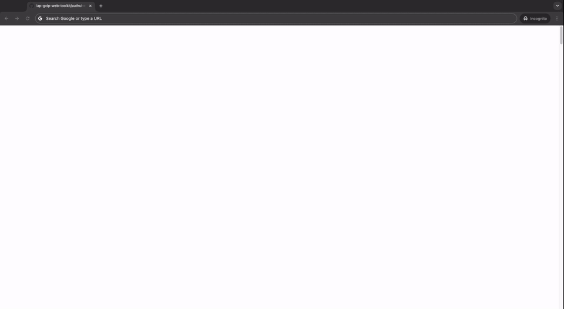

# IAP Protected Application Using Workforce Identity Federation

The steps below detail a method to establish an IAP protected App Engine site which allows access to [Workforce Identity](https://cloud.google.com/iam/docs/workforce-identity-federation) managed identities sourced from Okta.
- https://cloud.google.com/iap/docs/use-workforce-identity-federation
- https://cloud.google.com/iam/docs/workforce-sign-in-okta
- https://cloud.google.com/iam/docs/manage-workload-identity-pools-providers

## Google Disclaimer
This is not an officially supported Google product

## Prerequisites
- An existing Google Project
- A free Okta account
- An established Workforce Identity Pool
    - If you don't have one established, [this Github Repo](https://github.com/dreardon/gcp-workforce-identity-federation-okta) shows how I established the Okta one used below
    - [Okta Workforce Identity Pool](https://cloud.google.com/iam/docs/workforce-sign-in-okta) documentation from Google Cloud



```bash
#!/bin/bash
export PROJECT_ID=[Google Project ID]
export REGION=[Google Region]
export WORKFORCE_POOL_NAME=[Google Workforce Pool Name]

#App Engine Sample Application Deployment
printf 'y' |  gcloud services enable appengine.googleapis.com
gcloud app create --project=$PROJECT_ID --region=$REGION

gcloud projects add-iam-policy-binding ${PROJECT_ID} \
    --member="serviceAccount:${PROJECT_ID}@appspot.gserviceaccount.com" \
    --role='roles/logging.logWriter'

gcloud projects add-iam-policy-binding ${PROJECT_ID} \
    --member="serviceAccount:${PROJECT_ID}@appspot.gserviceaccount.com" \
    --role='roles/storage.admin'

gcloud projects add-iam-policy-binding ${PROJECT_ID} \
    --member="serviceAccount:${PROJECT_ID}@appspot.gserviceaccount.com" \
    --role='roles/artifactregistry.reader'

gcloud projects add-iam-policy-binding ${PROJECT_ID} \
    --member="serviceAccount:${PROJECT_ID}@appspot.gserviceaccount.com" \
    --role='roles/artifactregistry.createOnPushWriter'

gcloud app deploy ./app.yaml --project=$PROJECT_ID

# OAuth Configuration
OAUTH_CLIENT_NAME=iap-workforce-client
OAUTH_CLIENT_CREDENTIAL_NAME=iap-workforce-credential
gcloud iam oauth-clients create $OAUTH_CLIENT_NAME \
    --project=$PROJECT_ID \
    --location=global \
    --client-type="CONFIDENTIAL_CLIENT" \
    --display-name="OAuth for Workforce Identity" \
    --description="Oauth for Workforce Identity" \
    --allowed-scopes="https://www.googleapis.com/auth/cloud-platform" \
    --allowed-redirect-uris="https://temp.com" \
    --allowed-grant-types="authorization_code_grant"

OAUTH_CLIENT_ID=$(gcloud iam oauth-clients describe $OAUTH_CLIENT_NAME \
    --project $PROJECT_ID \
    --format 'value(clientId)' \
    --location global)

gcloud iam oauth-clients update $OAUTH_CLIENT_NAME \
    --project=$PROJECT_ID \
    --location=global \
    --allowed-redirect-uris="https://iap.googleapis.com/v1/oauth/clientIds/$OAUTH_CLIENT_ID:handleRedirect"

gcloud iam oauth-clients credentials create $OAUTH_CLIENT_CREDENTIAL_NAME \
    --oauth-client=$OAUTH_CLIENT_NAME \
    --display-name='IAP Workforce Credential' \
    --location='global'

OAUTH_CLIENT_SECRET=$(gcloud iam oauth-clients credentials describe $OAUTH_CLIENT_CREDENTIAL_NAME \
    --oauth-client=$OAUTH_CLIENT_NAME \
    --format 'value(clientSecret)' \
    --location='global')

#IAP Configuration
printf 'y' |  gcloud services enable iap.googleapis.com --project=$PROJECT_ID

cat <<EOF > iap_settings.yaml
access_settings:
  identity_sources: ["WORKFORCE_IDENTITY_FEDERATION"]
  workforce_identity_settings:
    workforce_pools: ["$WORKFORCE_POOL_NAME"]
    oauth2:
      client_id: "$OAUTH_CLIENT_ID"
      client_secret: "$OAUTH_CLIENT_SECRET"
EOF

gcloud iap settings set iap_settings.yaml \
  --project=$PROJECT_ID \
  --resource-type=app-engine

#Grants Access to All Identities in Pool
WORKFORCE_PROVIDER_NAME=okta-workforce-pool
gcloud iap web add-iam-policy-binding \
    --member=principalSet://iam.googleapis.com/locations/global/workforcePools/$WORKFORCE_PROVDER_NAME/* \
    --role='roles/iap.httpsResourceAccessor' \
    --project=$PROJECT_ID \
    --resource-type=app-engine
```